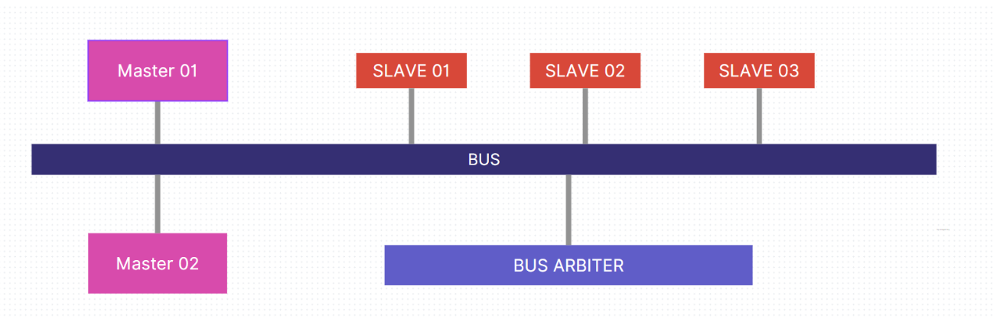

# Serial Bus Design Project

## Project Overview

This project implements a sophisticated Serial Bus system with advanced digital system design techniques, developed as part of the Advanced Digital Systems course (EN4021) at the University of Moratuwa.

## Technical Architecture

### System Block Diagram

### Detailed Component Design

#### 1. Masters
##### Master Architecture
- 8-bit data width
- 14-bit address bus
- State Machine Design
  - IDLE State
  - REQUEST State
  - EXECUTE State

##### Master Interface Specifications
- Inputs:
  - Clock (CLK)
  - Reset (RSTN)
  - Grant Signal
  - Slave Acknowledgement (SLACK)
  - 8-bit Data Input

- Outputs:
  - 14-bit Slave Address
  - Master Request Signal
  - 8-bit Data Output
  - Read/Write Control Signal

##### State Transition Logic
1. IDLE: Waiting for read/write operation
2. REQUEST: Assert bus request
3. EXECUTE: Perform read/write transaction
4. Complete: Return to IDLE state

#### 2. Slaves
##### Slave Types
- Slave 1: 4K memory with split transaction support
- Slave 2: 4K standard memory
- Slave Bridge: External communication interface

##### Slave Interface Features
- Dual-clock FIFO modules
- Cross-domain communication support
- Split transaction handling
- Configurable memory size

##### Split Transaction Mechanism
- Allows a slave to temporarily pause a transaction
- Enables more efficient bus utilization
- Supports multiple masters with different transaction priorities

#### 3. Bus Arbiter
##### Arbitration Strategy
- Priority-based master selection
- Master 1 has higher priority than Master 2
- Split transaction support
- Dynamic master tracking

##### Arbitration States
1. IDLE: No active master
2. GRANT_MASTER1: Master 1 granted bus access
3. GRANT_MASTER2: Master 2 granted bus access

#### 4. Address Decoder
##### Address Mapping
```
Address Range    | Slave
----------------|------------------
01XX XXXX XXXX  | Slave 1 (4K, Split)
10XX XXXX XXXX  | Slave 2 (4K)
11XX XXXX XXXX  | Slave Bridge
```

##### Decoding Logic
- Uses first 2 bits of 14-bit address
- Generates slave select signals
- Supports dynamic slave selection based on master grant

### Advanced Design Techniques

#### 1. Finite State Machines (FSM)
- Implemented in Verilog
- Clear state transition logic
- Predictable behavior
- Modular design approach

#### 2. Dual-Clock FIFO
- Enables communication between different clock domains
- Prevents metastability issues
- Supports asynchronous data transfer

#### 3. Split Transaction Handling
- Allows non-blocking bus operations
- Improves overall system throughput
- Enables more complex transaction scenarios

### Timing Constraints
- Clock Frequency: 50 MHz (20 ns period)
- Setup/Hold Times:
  - Input Delay: 8 ns (40% of clock period)
  - Output Delay: 5 ns (25% of clock period)
- Jitter: 1 ns (5% of clock period)

### Performance Characteristics
- Transaction Latency: Minimized through split transaction support
- Bandwidth: Optimized by priority-based arbitration
- Scalability: Modular design allows easy expansion

## Implementation Details

### Hardware Platform
- FPGA: Altera Development Board
- Development Tools:
  - Verilog HDL
  - ModelSim (Simulation)
  - Quartus (Synthesis and Implementation)

### Verification Methodology
- Unit-level testing for each module
- Top-level testbench development
- Comprehensive transaction simulation
  - Master read/write transactions
  - Slave read/write transactions
  - Split transaction scenarios
  - Multi-master bus arbitration

## Conclusion
A robust, flexible serial bus design demonstrating advanced digital system design principles, featuring priority-based arbitration, split transactions, and efficient cross-domain communication.

## Future Work
- Implement more advanced arbitration algorithms
- Increase number of masters and slaves
- Add error detection and correction mechanisms
- Develop more comprehensive verification testbenches


## Acknowledgments
- University of Moratuwa
- Department of Electronic and Telecommunication Engineering